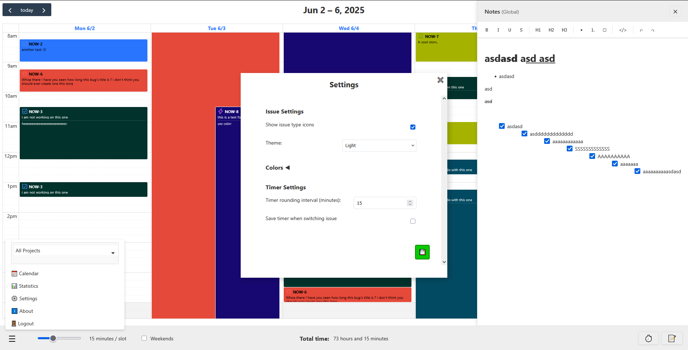
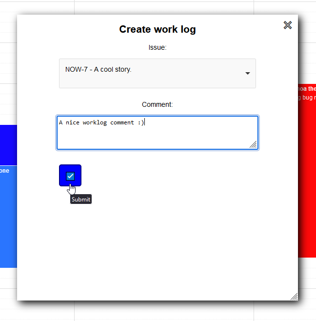
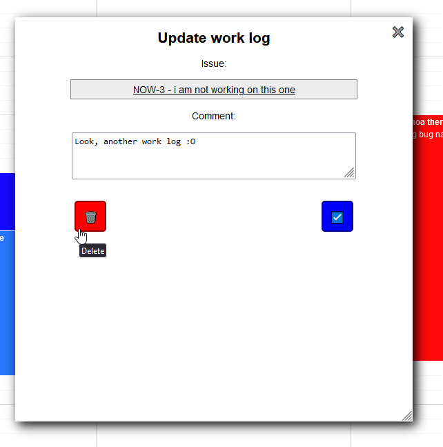
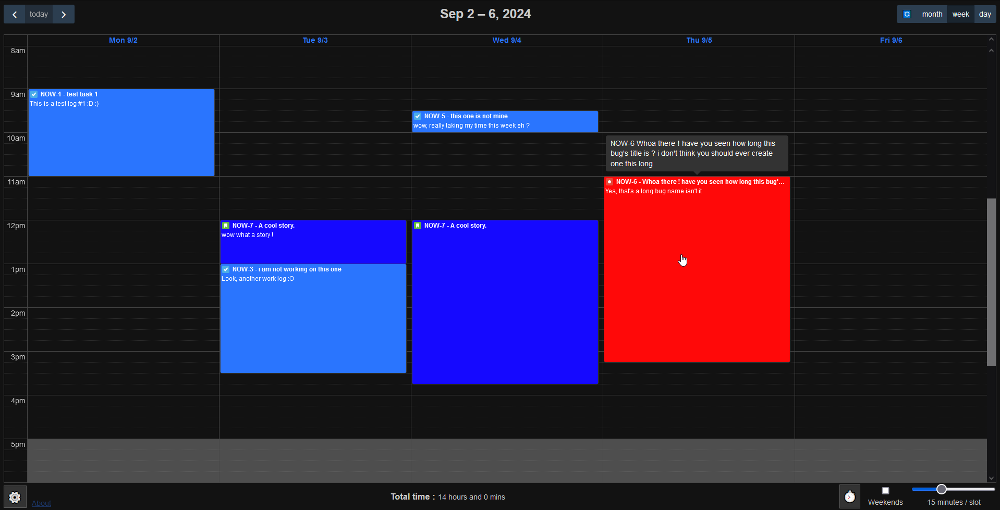
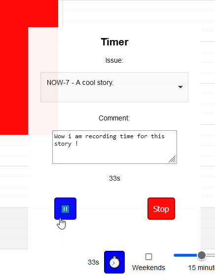
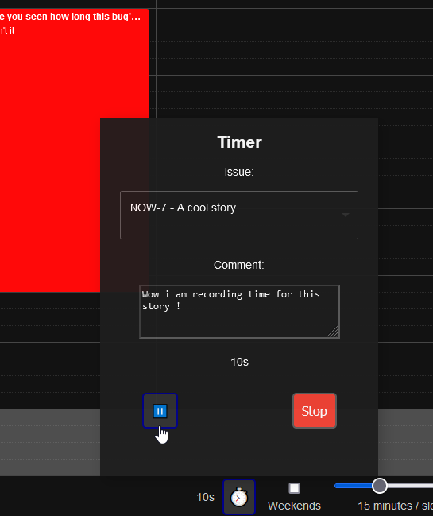
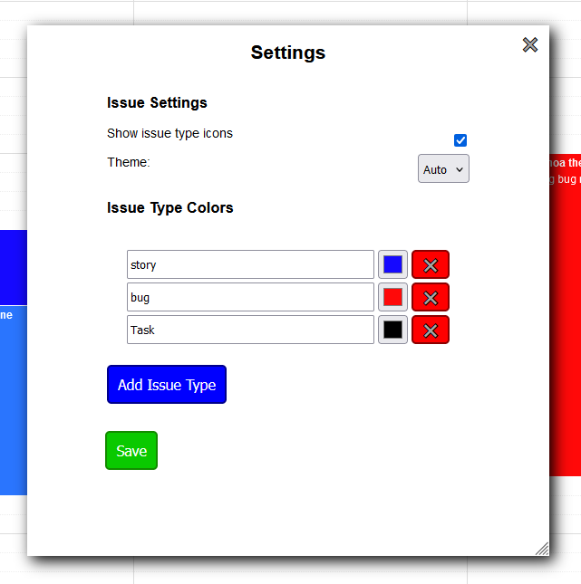

# Plywood
A quick and dirty NodeJS app to manage Jira worklogs using API access

work *logs*... timesheets... wood sheets... plywood... you get it :)

## Features :
- Themes: Light, dark, and auto (based on system theme)
- Timer: Record time for an issue 
- Configurable colors based on issue types or keys
- Issue type icons from your Jira instance
- Create and update worklogs in a FullCalendar instance
- Supports OAuth2
- HTTPS support

HTTPS Is still not yet properly implemented, but is planned

## Screenshots
### Light theme

### Dark theme

### Timer 

### Issue type colors

### How to use : 

1. install Nodejs 
2. modify the 'example.env' file to add your jira information, then save it as '.env'
3. execute start.bat
4. app is now accessible at 'http://localhost:3000'

### Librairies used 
(This list is not 100% complete)

[Fullcalendar](https://fullcalendar.io/)

[Tippy.js](https://atomiks.github.io/tippyjs/)

[Choices.JS](https://github.com/Choices-js/Choices)

[Momentjs](https://momentjs.com/)

[Express](https://expressjs.com/)

Open to PRs, Licensed under MIT