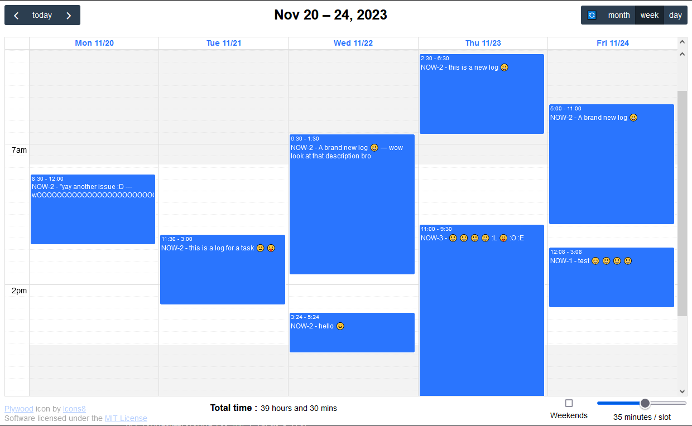

# Plywood
A quick and dirty NodeJS app to manage Jira worklogs using API access

work *logs*... timesheets... wood sheets... plywood... you get it :)

### How to use : 

1. install Nodejs 
2. modify the 'example.env' file to add your jira information, then save it as '.env'
3. open a terminal in the extracted / cloned folder (ex: 'cd c:\plywood')
4. install the app with 'npm install'
5. run the app with 'npm run start'
6. app is now accessible at 'http://localhost:3000'

### Librairies used 
(some of them anyways)

[Fullcalendar](https://fullcalendar.io/)

[Popper](https://popper.js.org/)

[Choices.JS](https://github.com/Choices-js/Choices)

[Momentjs](https://momentjs.com/)

[Express](https://expressjs.com/)

Open to PRs, Licensed under MIT