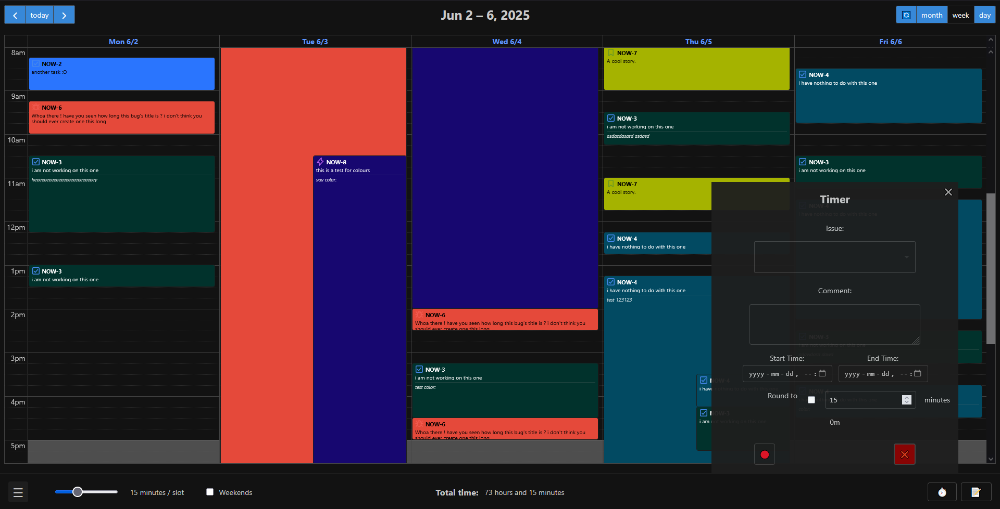

# Plywood
A modern NodeJS application for managing Jira worklogs with a calendar-based interface

work *logs*... timesheets... wood sheets... plywood... you get it :)

## Features :
- **Calendar Interface**: Visual worklog management with FullCalendar
- **Themes**: Light, dark, and auto (based on system theme)
- **Timer**: Record time for issues with built-in timer functionality
- **Project Filtering**: Filter worklogs by specific Jira projects
- **Color Management**: Configurable colors based on issue types, keys, or hierarchy
- **Issue Type Icons**: Display issue type icons from your Jira instance
- **Drag & Drop**: Move and resize worklogs directly on the calendar
- **Sprint Management**: View current sprint information and manage sprint notes
- **Notes System**: Global and sprint-specific note-taking capabilities
- **OAuth2 & Basic Auth**: Supports both authentication methods (OAuth2 recommended)
- **Multi-user Support**: Per-user configuration and data isolation
- **Optimistic Updates**: Smooth UI updates with automatic rollback on errors
- **Responsive Design**: Works on desktop and mobile devices

## New Features in Latest Version:
- **Sprint Integration**: View active sprints and manage sprint-specific notes
- **Notes Panel**: Side panel for taking notes with auto-save functionality
- **Project Selection**: Filter calendar view by specific Jira projects
- **Enhanced Color System**: Hierarchical color determination (issue → parent → type → default)
- **Issue Hierarchy Support**: Proper handling of subtasks and parent issues
- **Improved Error Handling**: Better error messages and automatic token refresh
- **Performance Optimizations**: Caching and optimistic updates for faster UI

## Screenshots
### Light theme


### Dark theme



### Timer 


### Configuration


## Installation & Setup

### Prerequisites
- Node.js (v14 or higher)
- Jira Cloud/Server instance with API access
- **Recommended**: OAuth2 app credentials for secure authentication
- **Not Recommended**: API token for basic auth (less secure, limited functionality)

### Quick Start
1. Install Node.js from [nodejs.org](https://nodejs.org/)
2. Clone or download this repository
3. Copy `example.env` to `.env` and configure your Jira settings:

#### **Recommended: OAuth2 Configuration (Secure & Full-Featured)**
   ```env
   # OAuth2 Configuration (RECOMMENDED)
   JIRA_AUTH_TYPE=OAUTH
   JIRA_OAUTH_CLIENT_ID=your-oauth-client-id
   JIRA_OAUTH_CLIENT_SECRET=your-oauth-client-secret
   ```

#### **Legacy: Basic Auth Configuration (Not Recommended)**
   ```env
   # Basic Auth Configuration (DEPRECATED - Use OAuth2 instead)
   # WARNING: Less secure, may have limited functionality
   JIRA_AUTH_TYPE=BASIC
   JIRA_URL=your-domain.atlassian.net
   JIRA_BASIC_AUTH_USERNAME=your-email@domain.com
   JIRA_BASIC_AUTH_API_TOKEN=your-api-token
   ```

4. Run `npm install` to install dependencies
5. Execute `start.bat` (Windows) or `npm start` (all platforms)
6. Open your browser to `http://localhost:3000`

### Authentication Methods

#### **OAuth2 (Recommended)**
- ✅ **Secure**: No API tokens stored in configuration
- ✅ **Full Access**: Access to all Jira features and APIs
- ✅ **User Context**: Operations performed as the authenticated user
- ✅ **Token Refresh**: Automatic token renewal for uninterrupted access
- ✅ **Multi-tenant**: Works with multiple Jira instances
- ✅ **Audit Trail**: Better tracking in Jira audit logs

**Setup OAuth2:**
1. Create an OAuth2 app in your Atlassian Developer Console
2. Configure redirect URI: `http://localhost:3000/auth/callback`
3. Copy Client ID and Client Secret to your `.env` file
4. Users authenticate through Atlassian's secure login flow

#### **Basic Auth (Deprecated)**
- ⚠️ **Security Risk**: API tokens stored in configuration files
- ⚠️ **Limited Scope**: May not work with all Jira features
- ⚠️ **Manual Management**: No automatic token refresh
- ⚠️ **Single User**: Tied to one specific user account
- ⚠️ **Audit Issues**: All actions appear to come from API token owner

**Why OAuth2 is Better:**
- **Security**: No long-lived tokens stored locally
- **Flexibility**: Each user authenticates with their own credentials
- **Compliance**: Better meets enterprise security requirements
- **Functionality**: Access to newer Jira APIs and features
- **Maintenance**: Automatic token management

### Environment Variables
- `JIRA_AUTH_TYPE`: Authentication method (`OAUTH` recommended, `BASIC` deprecated)
- `JIRA_OAUTH_CLIENT_ID`: OAuth2 client ID (for OAuth - recommended)
- `JIRA_OAUTH_CLIENT_SECRET`: OAuth2 client secret (for OAuth - recommended)
- `JIRA_URL`: Your Jira domain (for Basic Auth only - deprecated)
- `JIRA_BASIC_AUTH_USERNAME`: Your email address (for Basic Auth only - deprecated)
- `JIRA_BASIC_AUTH_API_TOKEN`: API token from Jira (for Basic Auth only - deprecated)
- `PORT`: Server port (default: 3000)
- `SESSION_SECRET`: Secret for session encryption

### Migration from Basic Auth to OAuth2

If you're currently using Basic Auth, we strongly recommend migrating to OAuth2:

1. **Create OAuth2 App**: Set up an OAuth2 application in Atlassian Developer Console
2. **Update Environment**: Change `JIRA_AUTH_TYPE=OAUTH` and add OAuth2 credentials
3. **Remove Basic Auth**: Remove `JIRA_URL`, `JIRA_BASIC_AUTH_USERNAME`, and `JIRA_BASIC_AUTH_API_TOKEN`
4. **Restart Application**: Users will be prompted to authenticate via OAuth2
5. **Enhanced Security**: Enjoy improved security and functionality

**Benefits of Migration:**
- Improved security posture
- Better user experience with single sign-on
- Access to newer Jira features
- Reduced maintenance overhead
- Better compliance with security policies

## Usage

### Calendar View
- **Create Worklog**: Click and drag on the calendar to select time range
- **Edit Worklog**: Click on existing worklog entries
- **Move Worklog**: Drag worklog entries to different times
- **Resize Worklog**: Drag the bottom edge to adjust duration
- **Color Worklog**: Right-click to change colors per issue

### Timer
- Start timer for any Jira issue
- Automatic time rounding (configurable)
- Save timer directly to Jira worklog
- Continue timing across browser sessions

### Sprint Management
- View current active sprint information
- Add and manage sprint-specific notes
- Access sprint details and timeline

### Notes System
- Global notes for general information
- Sprint-specific notes linked to active sprints
- Auto-save functionality with visual indicators
- Keyboard shortcut: `Ctrl+N` (or `Cmd+N` on Mac)

### Configuration
- **Themes**: Switch between light, dark, or auto themes
- **Colors**: Configure colors by issue type or specific issue keys
- **Projects**: Filter calendar view by specific projects
- **Timer Settings**: Adjust rounding intervals and behavior
- **Display Options**: Toggle issue type icons and other visual elements

## Technical Details

### Authentication & Security
- **OAuth2 Flow**: Secure authentication with automatic token refresh
- **Session Management**: Encrypted session storage with secure cookies
- **Per-user Isolation**: Complete data separation between users
- **API Security**: Secure communication with Jira APIs
- **Token Management**: Automatic handling of token expiration and renewal

**Security Best Practices:**
- Always use OAuth2 for production deployments
- Regularly rotate OAuth2 client secrets
- Use HTTPS in production environments
- Implement proper session timeouts
- Monitor authentication logs

### Architecture
- **Frontend**: Modern ES6 modules with FullCalendar
- **Backend**: Express.js with RESTful API design
- **Authentication**: JWT sessions with automatic token refresh (OAuth2)
- **Data Storage**: File-based configuration per user
- **Caching**: Multi-layer caching for performance

### API Endpoints
- `/events` - Calendar events (worklogs)
- `/worklog` - CRUD operations for worklogs
- `/config` - User configuration management
- `/sprints` - Sprint information and management
- `/notes` - Notes system endpoints
- `/projects` - Project filtering

### Security Features
- Per-user data isolation
- Secure session management
- API token encryption
- HTTPS support (configurable)
- Input validation and sanitization

## Libraries Used

### Frontend
- [FullCalendar](https://fullcalendar.io/) - Calendar interface
- [Choices.js](https://github.com/Choices-js/Choices) - Enhanced select dropdowns
- [Tippy.js](https://atomiks.github.io/tippyjs/) - Tooltips and popovers
- [Moment.js](https://momentjs.com/) - Date/time manipulation
- [Day.js](https://day.js.org/) - Lightweight date library

### Backend
- [Express.js](https://expressjs.com/) - Web framework
- [Nunjucks](https://mozilla.github.io/nunjucks/) - Template engine
- [Passport.js](http://www.passportjs.org/) - Authentication middleware
- [node-fetch](https://github.com/node-fetch/node-fetch) - HTTP client
- [async-mutex](https://github.com/DirtyHairy/async-mutex) - Concurrency control

## Contributing

We welcome contributions! Please feel free to:
- Report bugs or request features via GitHub Issues
- Submit pull requests for improvements
- Share feedback and suggestions

**Security Guidelines:**
- All new features should support OAuth2 authentication
- Basic Auth support is maintained for legacy compatibility only
- Security-related changes require thorough testing
- Follow OWASP security guidelines

### Development Setup
1. Follow the installation steps above (use OAuth2 for development)
2. Install development dependencies: `npm install --dev`
3. Run in development mode: `npm run dev`
4. Make your changes and test thoroughly
5. Submit a pull request with clear description

## License

Licensed under MIT License - see LICENSE file for details.

## Support

For issues, questions, or feature requests:
- Create an issue on GitHub
- Check existing documentation and issues first
- Provide detailed information about your environment and the problem

**Security Issues:**
- Report security vulnerabilities privately via email
- Do not post security issues in public GitHub issues
- We will respond to security reports within 48 hours

## Roadmap

Planned features for future releases:
- **OAuth2 Enhancements**: Enhanced OAuth2 flow with PKCE support
- **Security Improvements**: Additional security features and audit logging
- **Basic Auth Deprecation**: Phased removal of basic auth support
- Bulk worklog operations
- Advanced reporting and analytics
- Team collaboration features
- Integration with other Atlassian tools
- Mobile app companion
- Advanced filtering and search capabilities

**Deprecation Notice:**
- Basic Auth support will be deprecated in future versions
- New features will be OAuth2-only
- Existing Basic Auth installations should migrate to OAuth2
- Final Basic Auth support removal planned for v3.0